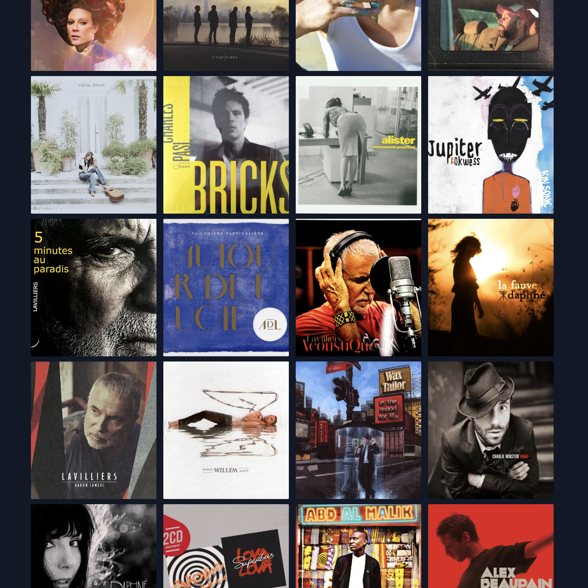

# Album Cover

## Overview

This is a fast-loading web application showcasing my work as an audio engineer. It provides a quick and visually appealing overview of the albums I've worked on.

## Technologies Used

- **React & TypeScript:** For building the user interface and ensuring type safety.
- **Vite:** For rapid development and hot module replacement.
- **@tanstack/react-query:** For efficient data fetching and caching from the Discogs API.
- **react-modal:** For creating the modal component to display album details.
- **Tailwind CSS:** For styling the application with a utility-first approach.

## Features

- **Album Covers:** Displays the covers of the primary albums I've worked on.
- **Modal with Details:** Clicking on an album cover opens a modal that provides additional information about the selected album, fetched from the Discogs API.
- **Discogs API integration:** Album data is retrieved via the Discogs API, guaranteeing a rich and up-to-date source of information.

## Presentation

